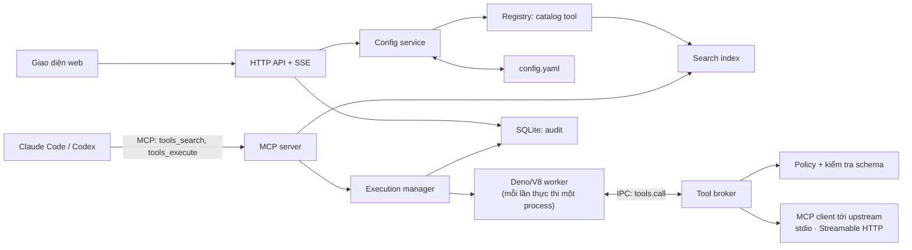

# ⚡ Code Mode MCP Gateway

Một gateway MCP tự host giúp AI agent (Claude Code, Codex, …) dùng **hàng chục MCP server cùng lúc mà không làm đầy context window**.

Thay vì đưa toàn bộ danh sách tool cho mô hình, gateway chỉ công bố **hai tool**: `tools_search` để tìm tool khi cần, và `tools_execute` để chạy một đoạn JavaScript gọi các tool đó trong sandbox. Mô hình viết code để phối hợp tool, và chỉ nhận lại kết quả cuối cùng. Cách làm này được gọi là **Code Mode**.

```text
Claude Code / Codex  ──►  Code Mode Gateway  ──►  GitHub MCP, Database MCP, Slack MCP, …
     (thấy 2 tool)         (sandbox + policy)         (hàng trăm tool)
```

- 🧩 [Vấn đề: MCP tốn context như thế nào](#-vấn-đề-mcp-tốn-context-như-thế-nào)
- 💡 [Code Mode giải quyết ra sao](#-code-mode-giải-quyết-ra-sao)
- 🧪 [Ví dụ cụ thể](#-ví-dụ-cụ-thể)
- 🚀 [Bắt đầu nhanh](#-bắt-đầu-nhanh)
- 🤖 [Kết nối agent](#-kết-nối-agent)
- ➕ [Thêm MCP server](#-thêm-mcp-server)
- 🛠️ [Lệnh thường dùng](#-lệnh-thường-dùng)
- 🩺 [Khắc phục sự cố](#-khắc-phục-sự-cố)

---

## 🧩 Vấn đề: MCP tốn context như thế nào

Khi kết nối trực tiếp, mỗi MCP server gửi cho client **tên, mô tả và JSON schema của từng tool**. Client đưa tất cả vào context để mô hình biết mình có thể gọi gì. Điều này sinh ra ba vấn đề.

### 📚 1. Định nghĩa tool chiếm context trước cả khi bắt đầu làm việc

Mỗi tool tốn vài trăm token cho mô tả và schema. Kết nối GitHub, Jira, Slack, Google Drive và một database là đã có hàng trăm tool nằm sẵn trong context — **dù câu hỏi hiện tại chỉ cần một hai tool**.

Ở quy mô lớn con số này trở nên không khả thi. Cloudflare ước tính nếu biến hơn 2.500 endpoint API của họ thành từng MCP tool, riêng phần định nghĩa đã tốn khoảng **1,17 triệu token** — lớn hơn context window của phần lớn mô hình hiện nay.

### 🔁 2. Dữ liệu trung gian đi qua mô hình, thường là nhiều lần

Với tool calling truyền thống, mỗi kết quả tool quay về cuộc hội thoại để mô hình đọc rồi mới quyết định bước tiếp theo. Nếu bước sau cần dữ liệu của bước trước, mô hình phải **chép lại dữ liệu đó** vào tham số của lần gọi kế tiếp.

Anthropic đưa ra ví dụ: *“Tải biên bản cuộc họp từ Google Drive rồi đính kèm vào lead trên Salesforce.”* Toàn bộ biên bản đi qua context hai lần — một lần khi đọc, một lần khi ghi. Với cuộc họp 2 giờ, đó là thêm khoảng **50.000 token** chỉ để chuyển dữ liệu từ tool này sang tool kia.

### 🧠 3. Mô hình giỏi viết code hơn là gọi tool

Tool calling dùng các token đặc biệt mà mô hình chỉ được học qua dữ liệu huấn luyện tổng hợp. Ngược lại, mô hình đã đọc hàng tỷ dòng code thật. Như nhóm Cloudflare nhận xét: *“LLMs have seen a lot of code. They have not seen a lot of tool calls.”*

Hệ quả là khi có nhiều tool, việc chọn đúng tool, truyền đúng tham số và nối nhiều lần gọi với nhau trở nên kém tin cậy. Những thao tác rất bình thường trong code — vòng lặp phân trang, lọc, `if/else`, `try/catch`, chạy song song — lại phải thực hiện bằng cả chuỗi lượt hội thoại.

## 💡 Code Mode giải quyết ra sao

Code Mode đổi cách mô hình dùng tool: **thay vì gọi từng tool, mô hình viết một đoạn chương trình gọi chúng.**

| | Tool calling truyền thống | Code Mode qua gateway này |
|---|---|---|
| Tool mô hình nhìn thấy | Tất cả tool của mọi server | 2 tool: `tools_search`, `tools_execute` |
| Khi nào nạp schema | Luôn luôn, ngay từ đầu | Chỉ khi tìm thấy tool cần dùng |
| Dữ liệu trung gian | Đi qua context sau mỗi lần gọi | Ở lại trong sandbox |
| Nối nhiều bước | Mỗi bước một lượt hội thoại | Một đoạn code, một lần thực thi |
| Vòng lặp, lọc, song song | Mô hình tự làm bằng suy luận | `for`, `filter`, `Promise.all` |
| Credential của upstream | Tùy từng client | Chỉ gateway giữ, code không thấy |

Luồng làm việc của agent:

1. 🔎 **Tìm tool khi cần.** Agent gọi `tools_search` với mô tả việc cần làm, ví dụ `"list open GitHub issues"`. Gateway trả về vài tool phù hợp kèm schema. Mô tả của `tools_search` chỉ liệt kê tên và mô tả của các namespace (`github`, `database`, …), không liệt kê từng tool.
2. ✍️ **Viết code để phối hợp.** Agent gửi JavaScript cho `tools_execute`. Code gọi tool qua `await tools.call("namespace.tool", args)`, có thể lặp, lọc, gọi song song và xử lý lỗi.
3. 📤 **Chỉ nhận kết quả cuối.** Gateway chạy code trong một worker Deno/V8 cô lập. Kết quả trung gian nằm trong worker; chỉ giá trị được `return` mới quay về agent.

Theo các thử nghiệm được công bố, cách tiếp cận này giảm lượng token rất mạnh: ví dụ Google Drive → Salesforce của Anthropic giảm từ khoảng **150.000 xuống 2.000 token (−98,7%)**; server Code Mode của Cloudflare đưa toàn bộ API hơn 2.500 endpoint vào khoảng **1.000 token (−99,9%)**. Mức tiết kiệm thực tế phụ thuộc số tool bạn kết nối và kích thước dữ liệu trung gian.

## 🧪 Ví dụ cụ thể

**Yêu cầu của người dùng:** *“Repo `acme/api` đang có bao nhiêu issue bug còn mở? Liệt kê 3 issue cũ nhất.”*

### ❌ Không dùng Code Mode

1. Context đã chứa sẵn schema của mọi tool GitHub (và của mọi server khác).
2. Agent gọi `list_issues` trang 1 → 100 issue dạng JSON đổ vào context.
3. Agent gọi trang 2, trang 3 → thêm 200 issue nữa.
4. Mô hình tự đọc hàng chục nghìn token để đếm và sắp xếp — dễ sai, tốn thời gian.

### ✅ Dùng Code Mode

**Bước 1** — agent tìm tool:

```json
{ "tool": "tools_search", "arguments": { "query": "list issues in a GitHub repository" } }
```

Gateway trả về `github.list_issues` cùng input schema của nó.

**Bước 2** — agent gửi code:

```js
// Gom tất cả trang, rồi chỉ trả về con số và 3 issue cũ nhất.
const issues = [];
for (let page = 1; ; page++) {
  const res = await tools.call("github.list_issues", {
    owner: "acme", repo: "api", state: "open", labels: ["bug"], perPage: 100, page,
  });
  const items = res.structuredContent?.items ?? [];
  issues.push(...items);
  if (items.length < 100) break;
}

issues.sort((a, b) => a.created_at.localeCompare(b.created_at));

return {
  openBugs: issues.length,
  oldest: issues.slice(0, 3).map(i => ({ number: i.number, title: i.title, openedAt: i.created_at })),
};
```

**Kết quả agent nhận được** — vài chục token thay vì hàng chục nghìn:

```json
{
  "result": {
    "openBugs": 214,
    "oldest": [
      { "number": 318, "title": "Timeout when exporting large reports", "openedAt": "2024-02-11T08:14:00Z" },
      { "number": 402, "title": "Webhook retries duplicate events", "openedAt": "2024-03-02T15:40:00Z" },
      { "number": 455, "title": "Locale fallback ignores region", "openedAt": "2024-03-19T10:05:00Z" }
    ]
  }
}
```

### 🔀 Chuyển dữ liệu giữa hai server mà không đi qua context

Biên bản cuộc họp đi thẳng từ Google Drive sang Salesforce bên trong sandbox; mô hình không bao giờ phải đọc nó:

```js
const doc = await tools.call("gdrive.get_document", { documentId: "abc123" });
const transcript = doc.structuredContent?.content ?? "";

await tools.call("salesforce.update_record", {
  objectType: "Lead", recordId: "00Q5f000001abcd",
  data: { Notes: transcript },
});

return { attached: true, characters: transcript.length };
```

### ⚡ Gọi song song nhiều server

```js
const [issues, deploys] = await Promise.all([
  tools.call("github.list_issues", { owner: "acme", repo: "api", state: "open" }),
  tools.call("vercel.list_deployments", { project: "api", limit: 5 }),
]);

return {
  openIssues: issues.structuredContent?.items?.length ?? 0,
  lastDeployState: deploys.structuredContent?.deployments?.[0]?.state ?? "unknown",
};
```

> 📝 Tên tool, tham số và cấu trúc kết quả trong các ví dụ trên phụ thuộc vào MCP server bạn cài. Agent luôn dùng `tools_search` để lấy đúng tên và schema trước khi viết code. Mỗi lần gọi trả về `{ content, structuredContent?, isError }`; nếu server chỉ trả `content` dạng text, code cần đọc text đó theo đúng định dạng của server.

## ✨ Tính năng

- 🔗 **Gom nhiều MCP server về một endpoint.** Hỗ trợ server chạy local qua **stdio** và server từ xa qua **Streamable HTTP**.
- 🎯 **Chỉ hai tool công khai**, số token cố định dù bạn kết nối bao nhiêu server.
- 📦 **Sandbox cô lập.** Mỗi lần thực thi chạy trong một process Deno/V8 riêng, có timeout, giới hạn bộ nhớ, giới hạn số lần gọi tool. Code không có quyền truy cập filesystem, mạng, biến môi trường hay `import`; cách duy nhất để ra ngoài là `tools.call`.
- 🔐 **Secret không rời khỏi gateway.** Token của các upstream chỉ nằm trong cấu hình của gateway; code do mô hình viết không bao giờ thấy chúng.
- 🚦 **Policy allow/deny** theo mẫu `namespace.tool` (ví dụ chặn `*.delete_*`). Tool bị chặn không xuất hiện khi tìm kiếm và bị từ chối khi gọi.
- 🖥️ **Giao diện web** để thêm/sửa MCP server, chỉnh cấu hình theo từng mục, duyệt tool và schema, theo dõi lịch sử thực thi. Có giao diện sáng và tối.
- 📊 **Audit an toàn.** Lịch sử lưu tên tool, quyết định policy, thời gian và kích thước; không lưu code, tham số hay dữ liệu trả về.

## 🚀 Bắt đầu nhanh

Chạy trên macOS và Linux.

**1. 📥 Cài đặt**

```sh
curl -fsSL https://github.com/gnoah1379/codemode-mcp-gateway/releases/latest/download/install.sh | sh
```

Trình cài đặt sẽ hỏi username và mật khẩu cho tài khoản quản trị, sau đó chạy gateway như một dịch vụ nền, tự khởi động mỗi khi bạn đăng nhập.

**2. 🌐 Mở giao diện quản lý**

Truy cập <http://127.0.0.1:8080> và đăng nhập bằng tài khoản vừa tạo.

**3. ➕ Thêm MCP server đầu tiên**

Vào **Upstreams → Add upstream**, điền lệnh chạy server (hoặc URL) và các biến môi trường cần thiết. Xem [Thêm MCP server](#-thêm-mcp-server).

**4. 🔌 Kết nối agent**

```sh
claude mcp add --transport http --scope user code-mode http://127.0.0.1:8080/mcp \
  --header "Authorization: Bearer $(codemode token client)"
```

Xem thêm cho Codex và các client khác ở [Kết nối agent](#-kết-nối-agent).

**5. 🎉 Thử ngay**

Mở Claude Code và hỏi một câu cần dùng tool, ví dụ *“Tóm tắt 5 pull request mới nhất của repo acme/api”*. Agent sẽ tự gọi `tools_search` rồi `tools_execute`. Bạn có thể xem từng lần thực thi trong trang **Executions**.

## 🤖 Kết nối agent

Gateway lắng nghe MCP tại `http://127.0.0.1:8080/mcp`. Client cần gửi API key trong header `Authorization: Bearer <key>`; lấy key bằng:

```sh
codemode token client
```

### 🟣 Claude Code

```sh
claude mcp add --transport http --scope user code-mode http://127.0.0.1:8080/mcp \
  --header "Authorization: Bearer $(codemode token client)"
```

Kiểm tra bằng `claude mcp list` hoặc gõ `/mcp` trong Claude Code. Nên dùng `--scope user`: cấu hình scope `project` có thể bị commit lên Git cùng API key. Xem [tài liệu MCP của Claude Code](https://code.claude.com/docs/en/mcp).

### 🟢 Codex CLI

Codex đọc API key từ một biến môi trường:

```sh
export CODE_MODE_GATEWAY_CLIENT_TOKEN="$(codemode token client)"
codex mcp add code-mode --url http://127.0.0.1:8080/mcp \
  --bearer-token-env-var CODE_MODE_GATEWAY_CLIENT_TOKEN
```

Thêm dòng `export` vào `~/.zshrc` hoặc `~/.bashrc` để không phải chạy lại mỗi lần mở terminal. Xem [tài liệu MCP của Codex](https://learn.chatgpt.com/docs/extend/mcp?surface=cli).

### 🔌 Client khác (stdio)

Với client chỉ hỗ trợ stdio, cấu hình client chạy lệnh `codemode stdio`:

```json
{
  "mcpServers": {
    "code-mode": { "command": "codemode", "args": ["stdio"] }
  }
}
```

Chế độ stdio dùng chung cấu hình (kể cả biến môi trường và header của upstream) với dịch vụ nền và không cần API key.

## ➕ Thêm MCP server

Cách đơn giản nhất là dùng trang **Upstreams** trong giao diện web. Mỗi server cần:

| Trường | Ý nghĩa |
|---|---|
| **Namespace** | Tiền tố cho tên tool, ví dụ `github` → `github.list_issues`. Viết thường, không đổi được sau khi tạo. |
| **Description** | Mô tả server dùng để làm gì. Agent đọc mô tả này để biết nên tìm tool ở đâu, nên viết rõ ràng. |
| **Transport** | *Local command (stdio)*: gateway tự chạy server bằng một lệnh. *Remote URL (HTTP)*: kết nối tới server Streamable HTTP. |
| **Command / Arguments** | Lệnh và các tham số, mỗi tham số một dòng, ví dụ `npx` với `-y` và `@modelcontextprotocol/server-github`. |
| **Environment variables / Headers** | Biến truyền cho server hoặc header gửi kèm request. Nhập tên và giá trị thật, ví dụ `GITHUB_TOKEN` = `ghp_xxx`. |

Thay đổi được áp dụng ngay; gateway tự khám phá tool của server mới. Nút **Test** kiểm tra kết nối, nút làm mới tải lại danh sách tool.

### 🔐 Biến môi trường và secret

Nhập thẳng tên và giá trị trong form, ví dụ `GITHUB_TOKEN` = `ghp_xxxxxxxxxxxxxxxxxxxx`, hoặc header `Authorization` = `Bearer sk-xxxxxxxx` (giá trị cần gồm cả tiền tố như `Bearer `). Không cần khởi động lại dịch vụ.

Giá trị được lưu trong `config.yaml` với quyền `600`, nên chỉ user của bạn đọc được. Server chạy local cũng nhận sẵn `PATH`, `HOME`, `USER`, `LOGNAME`, `SHELL`, `TMPDIR`, `LANG` của gateway để các lệnh như `npx` hay `docker` chạy được; các biến khác của gateway không được truyền xuống.

<details>
<summary>Cấu hình bằng file YAML</summary>

Mọi thiết lập trong giao diện web đều được lưu vào `~/.config/code-mode-gateway/config.yaml`. Bạn có thể sửa file trực tiếp rồi bấm **Settings → Reload from file**.

```yaml
upstreams:
  github:
    enabled: true
    description: Repository, issue and pull request operations.
    transport:
      type: stdio
      command: npx
      args: ["-y", "@modelcontextprotocol/server-github"]
      env:
        GITHUB_TOKEN: ghp_xxxxxxxxxxxxxxxxxxxx

  analytics:
    enabled: true
    description: Query product analytics and inspect table schemas.
    transport:
      type: streamable_http
      url: https://mcp.example.com/mcp
      headers:
        Authorization: Bearer sk-xxxxxxxx
```

</details>

## ⚙️ Cấu hình

Trang **Settings** chia cấu hình thành từng mục, mỗi mục là các ô nhập, công tắc và danh sách — không cần sửa YAML. Giá trị sai được báo ngay tại ô tương ứng trước khi lưu.

| Mục | Nội dung chính | Mặc định |
|---|---|---|
| Server & access | Địa chỉ lắng nghe, đường dẫn MCP, bật/tắt API key và đăng nhập | `127.0.0.1:8080`, `/mcp` |
| Tool search | Số kết quả mặc định/tối đa, dung lượng phản hồi | 5 / 20 tool, 64 KB |
| Execution sandbox | Timeout, số lần thực thi đồng thời, hàng chờ, số lần gọi tool, bộ nhớ, kích thước kết quả | 30 s, 4, 32, 50 lần gọi, 128 MB heap, 128 KB |
| Access policy | Quyết định mặc định, danh sách allow/deny, công cụ thử một tên tool | Cho phép tất cả |
| Logging & storage | Số ngày lưu lịch sử, mức log | 7 ngày, `info` |

Quy tắc policy: **deny luôn thắng**, sau đó đến allow, cuối cùng là quyết định mặc định. Mẫu có dạng `namespace.tool` với `*` là ký tự đại diện, ví dụ `github.*` hoặc `*.delete_*`.

## 🛠️ Lệnh thường dùng

| Lệnh | Tác dụng |
|---|---|
| `codemode service status` | Xem dịch vụ nền có đang chạy không |
| `codemode service start` / `stop` | Bật / tắt dịch vụ nền |
| `codemode token client` | In API key cho MCP client |
| `codemode admin reset-password` | Đặt lại mật khẩu quản trị |
| `codemode update` | Cập nhật lên bản mới nhất và khởi động lại dịch vụ |
| `codemode stdio` | Chạy gateway qua stdio cho client không hỗ trợ HTTP |
| `codemode service uninstall` | Gỡ dịch vụ nền, giữ nguyên cấu hình và dữ liệu |

Chạy `codemode --help` để xem đầy đủ.

## 🩺 Khắc phục sự cố

❓ **Terminal báo `codemode: command not found`.** Trình cài đặt đặt `codemode` vào `~/.local/bin`. Nếu thư mục này chưa có trong `PATH`, thêm dòng sau vào `~/.zshrc` hoặc `~/.bashrc` rồi mở terminal mới:

```sh
export PATH="$HOME/.local/bin:$PATH"
```

🔌 **Agent không thấy `tools_search` / `tools_execute`.** Kiểm tra `codemode service status`, đảm bảo URL là `http://127.0.0.1:8080/mcp` và API key khớp với `codemode token client`.

🔍 **`tools_search` không trả về tool nào.** Mở trang **Upstreams**: server phải ở trạng thái *Healthy*. Trạng thái *Unavailable* thường do thiếu hoặc sai biến môi trường, hay sai lệnh chạy; dòng lỗi dưới tên server cho biết lý do.

🔑 **Quên mật khẩu quản trị.** Chạy `codemode admin reset-password`.

🤖 **Cài trên máy không có terminal tương tác** (CI, script). Trình cài đặt không hỏi được mật khẩu; sau khi cài, chạy `codemode admin setup --username admin` trong một terminal rồi chạy `codemode service install`.

🐧 **Linux: dịch vụ dừng khi đăng xuất.** Dịch vụ chạy dưới `systemd --user`. Để nó tiếp tục chạy sau khi đăng xuất, bật lingering: `loginctl enable-linger $USER`.

## 🛡️ Bảo mật

- Gateway mặc định chỉ lắng nghe trên `127.0.0.1`. MCP endpoint yêu cầu API key; giao diện web và HTTP API yêu cầu đăng nhập.
- Chỉ được tắt xác thực khi gateway lắng nghe trên loopback. Để mở ra ngoài, gateway bắt buộc chạy sau một proxy có TLS và cấu hình `GATEWAY_TLS_TERMINATED=true`, `GATEWAY_ALLOWED_HOSTS`, `GATEWAY_ALLOWED_ORIGINS`.
- API key, tài khoản quản trị (mật khẩu đã băm) và lịch sử thực thi được lưu trong SQLite tại `~/.local/share/code-mode-gateway/gateway.db`.
- Hủy một lần thực thi không hoàn tác được các thay đổi đã gửi tới upstream. Với tool có tác dụng ghi hoặc xóa, hãy cân nhắc chặn bằng policy.
- Dự án hướng tới một chủ sở hữu dùng cho nhiều agent của mình, không phải môi trường multi-tenant cho các bên không tin cậy.

## 🧱 Phát triển

Cần Rust (phiên bản ghim trong [`rust-toolchain.toml`](rust-toolchain.toml)), Node.js 22 và npm.

```sh
npm ci --prefix web
npm run build --prefix web        # build giao diện vào public/, được nhúng vào binary
cargo build --release --locked
./target/release/codemode --config config.yaml serve
```

Khi sửa giao diện, chạy `npm run dev --prefix web` để có hot reload; dev server chuyển tiếp `/api` và `/mcp` tới gateway ở cổng 8080. Kiểm tra trước khi gửi thay đổi:

```sh
cargo fmt --check
cargo clippy --all-targets --all-features -- -D warnings
cargo test --locked
```

Mã nguồn giao diện nằm trong `web/src`:

```text
api/          HTTP client và các endpoint có kiểu (gateway.ts)
config/       Kiểu dữ liệu config.yaml, chuyển đổi YAML, validation phía client
hooks/        State dùng chung: dữ liệu realtime, cấu hình, theme, toast, routing
components/
  ui/         Thành phần cơ bản: Button, Card, Field, Switch, Modal, ListEditor, …
  layout/     Sidebar, Topbar, màn hình đăng nhập
pages/        Mỗi trang một thư mục; Settings chia thành các section độc lập
styles/       Design tokens (sáng/tối) và CSS theo lớp: base, layout, components, pages
```

Đẩy tag `v<version>` lên GitHub sẽ kích hoạt [release workflow](.github/workflows/release.yml) để build binary cho từng nền tảng và phát hành trình cài đặt.

### 🏗️ Kiến trúc



- **Tìm kiếm:** registry khám phá tool từ các upstream, lọc theo trạng thái và policy, rồi dựng chỉ mục tìm kiếm.
- **Thực thi:** mỗi lần gọi `tools_execute` được cấp một worker riêng với deadline và quota. Worker chỉ có cầu nối `tools.call`; broker phía Rust kiểm tra tên tool, schema tham số và policy trước khi gọi upstream.
- **Cấu hình:** mọi thay đổi (từ giao diện, API hay file) đều được kiểm tra và chuẩn bị registry trước khi thay thế cấu hình đang chạy. Ghi qua API dùng ETag để tránh ghi đè lẫn nhau.

### 📌 Trạng thái dự án

Gateway đã có unit test, integration test cho MCP và CI. Kết quả kiểm chứng và các giới hạn đã biết nằm trong [`implementation-report.md`](implementation-report.md) và [`review-report.md`](review-report.md). Một số tình huống như upstream mất kết nối giữa chừng hay phản hồi HTTP quá cỡ vẫn cần kiểm thử đầu cuối trước khi dùng trong môi trường nhạy cảm.

## 📖 Tài liệu tham khảo

- Cloudflare — [Code Mode: the better way to use MCP](https://blog.cloudflare.com/code-mode/) (09/2025)
- Anthropic — [Code execution with MCP: Building more efficient agents](https://www.anthropic.com/engineering/code-execution-with-mcp) (11/2025)
- Cloudflare — [Code Mode: give agents an entire API in 1,000 tokens](https://blog.cloudflare.com/code-mode-mcp/) (02/2026)
- [Model Context Protocol](https://modelcontextprotocol.io)
