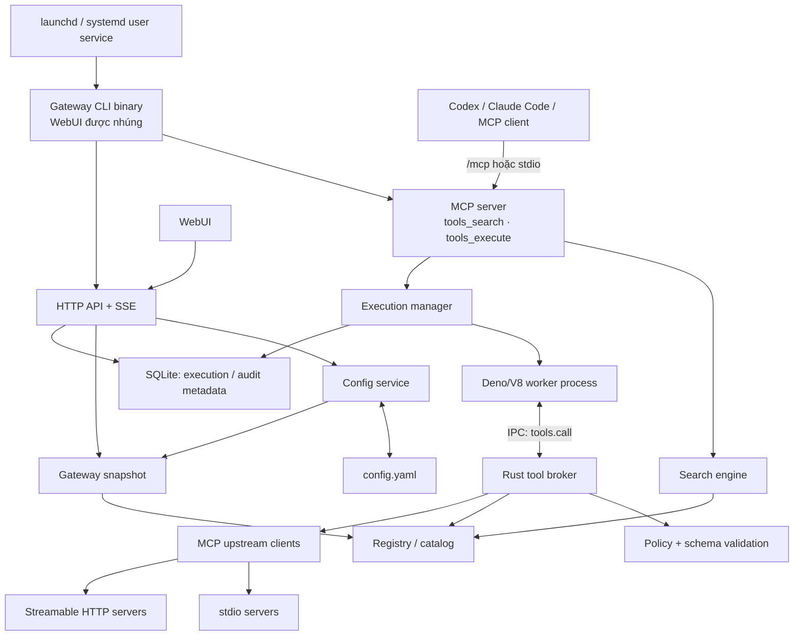

# 🚀 Code Mode MCP Gateway

Gateway MCP tự host, viết bằng Rust, giúp Codex, Claude Code và các MCP client khác tìm và phối hợp công cụ từ nhiều MCP server upstream. Gateway chỉ công bố hai tool cho client: `tools_search` và `tools_execute`.

## 🧩 Vấn đề

**Kết nối càng nhiều MCP server, lượng token dành cho tool càng lớn.** Trong cách sử dụng trực tiếp phổ biến, client đưa tên, mô tả và input schema của các tool từ từng server vào context để mô hình biết mình có thể gọi gì. Hàng chục hoặc hàng trăm tool có thể chiếm một phần đáng kể context **trước cả khi người dùng cần dùng chúng**. Mỗi tool mới hoặc schema dài lại làm phần metadata này lớn thêm, dù câu hỏi hiện tại chỉ liên quan đến một vài tool.

Context còn phình ra trong lúc thực hiện tác vụ. Ví dụ, để tóm tắt tình trạng repository, client gọi tool lấy issues rồi tool lấy pull requests; mỗi response trung gian quay về cuộc hội thoại để mô hình đọc, lọc và quyết định bước tiếp theo. Nếu mỗi response chứa nhiều bản ghi, mô hình phải nhận nhiều token dữ liệu thô dù câu trả lời cuối chỉ cần vài con số. Việc này tăng token sử dụng, chiếm chỗ của lịch sử hội thoại và có thể khiến thông tin quan trọng bị rút gọn hoặc đẩy khỏi context window.

Catalog lớn cũng khiến việc chọn đúng tool và arguments khó hơn. Khi các upstream có credential, trạng thái và policy riêng, client phải xử lý thêm nhiều chi tiết vận hành. Gateway tập trung phần khám phá và điều phối này cho một chủ sở hữu và nhiều MCP client; project không hướng tới multi-tenant cho các bên không tin cậy.

## 💡 Giải pháp

**Code Mode** là cách để client gửi một đoạn JavaScript mô tả *cách dùng các tool* tới gateway, thay vì tự thực hiện từng tool call và xử lý mọi response trong context. Đây là body của một async function: dùng được `await`, `Promise.all` và `return`. Script chỉ gọi upstream qua `tools.call("namespace.tool", args)`; nó không có quyền truy cập trực tiếp vào filesystem, network, environment, process, import hoặc Node API.

Gateway triển khai Code Mode theo luồng sau:

1. 🔎 **Tìm đúng tool khi cần:** Client chỉ nhìn thấy hai tool công khai. Mô tả của `tools_search` cho biết các namespace khả dụng, không nhúng toàn bộ danh sách tool/schema. Client tìm bằng câu mô tả thao tác; gateway trả tên, mô tả và schema của các kết quả phù hợp. Tool bị policy chặn hoặc upstream không khả dụng không xuất hiện trong kết quả.
2. 🧠 **Điều phối bằng code:** Client gửi script cho `tools_execute`. Script có thể gọi các tool độc lập song song, gọi tuần tự khi bước sau cần kết quả bước trước, rồi lọc hoặc tổng hợp dữ liệu. Response trung gian được xử lý trong worker; chỉ giá trị script `return` mới được đưa vào MCP result công khai.
3. 🛡️ **Giữ quyền kiểm soát ở host:** Mỗi execution chạy trong một Deno/V8 worker process mới, có deadline và quota. Worker gửi yêu cầu `tools.call` qua IPC tới Rust broker. Broker giữ kết nối và credential upstream, kiểm tra tên tool, schema arguments, policy và các giới hạn trước khi gọi server tương ứng. Audit ghi metadata của execution và call cho WebUI.

Ví dụ minh họa sau giả định `tools_search` đã trả về hai tool cùng schemas phù hợp. Tên tool, arguments và cấu trúc `structuredContent` thực tế phụ thuộc upstream:

```js
const [issues, pullRequests] = await Promise.all([
  tools.call("github.list_issues", { owner: "example", repo: "demo" }),
  tools.call("github.list_pull_requests", { owner: "example", repo: "demo" }),
]);

return {
  issueCount: issues.structuredContent?.items?.length ?? null,
  pullRequestCount: pullRequests.structuredContent?.items?.length ?? null,
};
```

Gateway trả `{"result":{"issueCount":12,"pullRequestCount":3}}` nếu các upstream trả dữ liệu tương ứng. Danh sách issue và pull request đầy đủ không tự động đi vào kết quả cuối. Nếu upstream chỉ trả `content` dạng text, script cần đọc cấu trúc đó theo hợp đồng của upstream; không nên mặc định text là JSON.

Nhờ chỉ đưa schema của tool được tìm thấy và kết quả cuối vào context, Code Mode có thể giảm số token client phải xử lý. Mức tiết kiệm phụ thuộc số MCP/tool đã kết nối, kích thước response trung gian và cách client sử dụng chúng.

Gateway hỗ trợ upstream MCP qua **stdio** và **Streamable HTTP**. WebUI cùng HTTP API dùng để chỉnh cấu hình YAML, xem catalog, theo dõi execution và audit metadata. SQLite lưu lịch sử thực thi; `config.yaml` là nguồn cấu hình có thể chỉnh sửa.

## 📋 Yêu cầu cài đặt

- Bản phát hành dựng sẵn cho **macOS arm64**, **macOS x86_64** hoặc **Linux x86_64**. Service sử dụng `launchd` trên macOS hoặc `systemd --user` trên Linux.
- `curl`, `tar` và `shasum` hoặc `sha256sum` để tải và xác minh bản phát hành từ GitHub.
- Executable hoặc URL của ít nhất một MCP server upstream nếu muốn tìm và gọi tool thật.

Máy cài bản phát hành **không cần Rust, Node.js hay Cargo**. Những công cụ đó chỉ cần khi build từ source.

## 🛠️ Cài đặt để chạy ngay

Installer tải binary từ [GitHub Releases](https://github.com/gnoah1379/codemode-mcp-gateway/releases), kiểm tra SHA-256, cài vào `~/.local/bin/`, tạo config và token riêng cho người dùng, rồi đăng ký/chạy background service.

1. Tải và chạy installer của bản phát hành mới nhất:

   ```sh
   curl -fsSL https://github.com/gnoah1379/codemode-mcp-gateway/releases/latest/download/install.sh -o /tmp/code-mode-gateway-install.sh
   sh /tmp/code-mode-gateway-install.sh
   ```

2. Lấy admin token để đăng nhập WebUI:

   ```sh
   ~/.local/bin/code-mode-mcp-server token admin
   ```

3. Mở `http://127.0.0.1:8080` và đăng nhập bằng admin token. MCP endpoint là `http://127.0.0.1:8080/mcp`; lấy client token cho MCP client bằng:

   ```sh
   ~/.local/bin/code-mode-mcp-server token client
   ```

MCP client gửi `Authorization: Bearer <client-token>` tới `/mcp`. Config nằm ở `~/.config/code-mode-gateway/config.yaml`, token ở `~/.config/code-mode-gateway/service.env` (mode `0600`) và SQLite ở `~/.local/share/code-mode-gateway/gateway.db`. Binary chứa WebUI, nên service không phụ thuộc thư mục hiện hành hay `public/` bên ngoài. Health endpoints là `/health/live` và `/health/ready`.

Quản lý service và cập nhật qua GitHub:

```sh
~/.local/bin/code-mode-mcp-server service status
~/.local/bin/code-mode-mcp-server service stop
~/.local/bin/code-mode-mcp-server service start
~/.local/bin/code-mode-mcp-server update
```

`update` tải installer từ GitHub Releases, xác minh binary mới và khởi động lại service nếu service đang chạy. Nếu `~/.local/bin` đã có trong `PATH`, có thể gọi trực tiếp `code-mode-mcp-server`. Trên Linux, systemd user service tự chạy khi đăng nhập; muốn tiếp tục chạy sau khi đăng xuất cần bật user lingering theo cấu hình hệ thống.

### 🤖 Kết nối Codex CLI

Các bước sau dùng Gateway **đang chạy nền** tại `http://127.0.0.1:8080/mcp`. Dùng **client token**, không dùng admin token. Trong terminal sẽ chạy Codex:

```sh
export CODE_MODE_GATEWAY_CLIENT_TOKEN="$(~/.local/bin/code-mode-mcp-server token client)"
codex mcp add code-mode-gateway \
  --url http://127.0.0.1:8080/mcp \
  --bearer-token-env-var CODE_MODE_GATEWAY_CLIENT_TOKEN
codex mcp list
codex
```

Codex lưu tên biến môi trường trong cấu hình MCP và đọc token từ biến đó khi kết nối. Khi mở terminal mới để chạy Codex CLI, chạy lại lệnh `export` trước `codex`. Nếu dùng Codex trong ứng dụng hoặc IDE, tiến trình đó cũng cần nhận được biến môi trường này. Xem [OpenAI Docs về MCP trong Codex](https://learn.chatgpt.com/docs/extend/mcp?surface=cli).

### 🟣 Kết nối Claude Code

Thêm Gateway ở scope `user` để dùng trong mọi project Claude Code:

```sh
claude mcp add --transport http --scope user \
  code-mode-gateway http://127.0.0.1:8080/mcp \
  --header "Authorization: Bearer $(~/.local/bin/code-mode-mcp-server token client)"
claude mcp list
```

Mở Claude Code và gõ `/mcp` để kiểm tra trạng thái kết nối. Lệnh trên lưu client token trong cấu hình Claude Code của người dùng. Giữ scope `user` vì cấu hình scope `project` có thể được đưa lên Git. Xem [hướng dẫn MCP của Claude Code](https://code.claude.com/docs/en/mcp).

Sau khi kết nối một trong hai client, yêu cầu agent dùng `tools_search` để tìm tool từ upstream và `tools_execute` để gọi tool. Nếu kết nối báo lỗi, kiểm tra `~/.local/bin/code-mode-mcp-server service status`, client token và địa chỉ `/mcp`. Gateway cần có ít nhất một upstream đã cấu hình để tìm được tool thực tế.

MCP client cũng có thể tự khởi chạy một Gateway local qua stdio bằng binary đã cài:

```sh
~/.local/bin/code-mode-mcp-server stdio
```

### 🔌 Thêm upstream

Có thể thêm upstream trong WebUI hoặc sửa [`config.yaml`](config.yaml). Ví dụ:

```yaml
upstreams:
  github:
    enabled: true
    description: Repository and issue operations.
    transport:
      type: stdio
      command: /absolute/path/to/github-mcp-server
      args: [stdio]
      env:
        GITHUB_TOKEN:
          from_env: GITHUB_TOKEN

  database:
    enabled: true
    description: Query application data and inspect schemas.
    transport:
      type: streamable_http
      url: https://mcp.example.com/mcp
      headers:
        Authorization:
          from_env: DATABASE_MCP_AUTHORIZATION
```

Đặt giá trị của `GITHUB_TOKEN` và `DATABASE_MCP_AUTHORIZATION` trong môi trường chạy gateway. YAML chỉ lưu tên biến môi trường, không lưu giá trị secret. Giá trị `Authorization` phải gồm cả prefix như `Bearer ` nếu upstream yêu cầu. Sau khi sửa file trực tiếp, gọi `POST /api/v1/config/reload` hoặc dùng nút **Reload file** trong WebUI để áp dụng.

Với service, thêm biến môi trường dành cho upstream vào `~/.config/code-mode-gateway/service.env`, mỗi dòng theo dạng `GITHUB_TOKEN=giá_trị`, rồi chạy `code-mode-mcp-server service stop` và `code-mode-mcp-server service start`. Giữ file ở mode `0600`. Stdio upstream chỉ nhận những biến được tham chiếu rõ trong YAML; không đặt secret dạng plaintext trong YAML.

## 🧱 Build từ source

Phần này dành cho người phát triển hoặc người muốn tự build binary. Cần Rust **1.93.1** (pin trong [`rust-toolchain.toml`](rust-toolchain.toml)), Node.js **22**, npm và C toolchain. Chạy từ thư mục gốc repository:

```sh
npm ci --prefix web
npm run build --prefix web
cargo build --release --locked
```

WebUI phải được build **trước** Rust để được nhúng vào binary. Có thể chạy binary trực tiếp ở foreground với cấu hình trong repository:

```sh
./target/release/code-mode-mcp-server --config config.yaml serve
```

Hoặc cài binary vừa build cho người dùng hiện tại và đăng ký service:

```sh
mkdir -p ~/.local/bin
install -m 755 target/release/code-mode-mcp-server ~/.local/bin/code-mode-mcp-server
~/.local/bin/code-mode-mcp-server init
~/.local/bin/code-mode-mcp-server service install
```

`cargo test --locked`, `cargo fmt --check` và `cargo clippy --all-targets --all-features -- -D warnings` là các lệnh kiểm tra source. Tag `v<version>` đẩy lên GitHub kích hoạt [release workflow](.github/workflows/release.yml), tạo các binary archive và `install.sh` cho phần cài đặt bên trên.

## 🏗️ Kiến trúc logic



**Luồng tìm kiếm:** Registry discovery tool và schema từ upstream, lọc theo trạng thái và policy rồi xây search index. `tools_search` trả các tool phù hợp trong giới hạn số lượng và dung lượng response. Mô tả namespace xuất hiện trong metadata của `tools_search`, giúp client biết phạm vi có thể tìm.

**Luồng thực thi:** Execution manager cấp worker riêng, deadline và quota cho request. Worker chỉ có bridge `tools.call`; broker phía Rust kiểm tra và gọi upstream. Script có thể gọi nhiều tool tuần tự hoặc song song, xử lý dữ liệu trung gian trong worker và trả về một JSON result. Audit ghi metadata như tên tool, quyết định policy, thời gian và số byte; không chủ động lưu source code, arguments hoặc payload tool.

**Luồng cấu hình:** WebUI/API và file reload đều đi qua Config service. Candidate được parse, validate và chuẩn bị registry/search trước khi thay snapshot đang dùng. Ghi qua API dùng ETag/`If-Match` và atomic rename; sửa file ngoài API chỉ có hiệu lực sau reload thành công.

## 📌 Trạng thái hiện tại

Mặc định có deadline 30 giây, tối đa 4 execution đồng thời, hàng chờ 32, 50 tool call mỗi execution và giới hạn kích thước arguments/result. Gateway đã có unit test, MCP integration test, CI format/Clippy và WebUI build. Kết quả compatibility và các giới hạn kiểm chứng nằm trong [`implementation-report.md`](implementation-report.md).

Các phát hiện về logic và phần chưa đạt spec được ghi trong [`review-report.md`](review-report.md). Ba lỗi mức cao trong bản review ban đầu đã được chỉnh sửa cùng với phần đóng gói CLI; các tình huống như upstream disconnect, HTTP response quá cỡ, cancel race và canary leak vẫn cần kiểm thử đầu cuối trước khi triển khai ở môi trường nhạy cảm.
